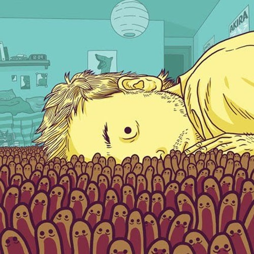
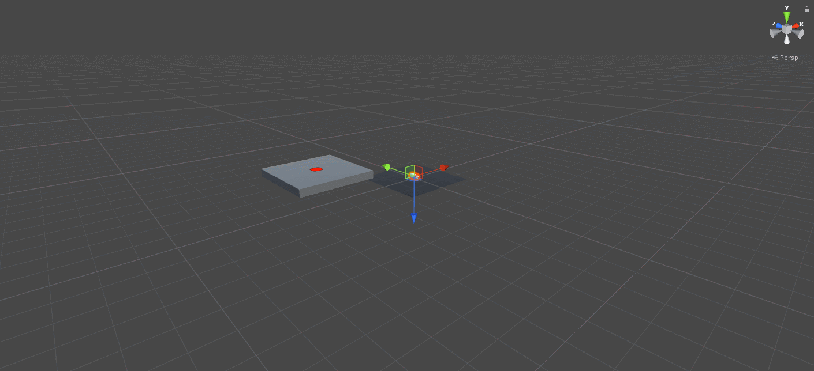

## Top Down Shooter Game
The project is top down camera angle shooter game that the player avoid and try to survive from enemy waves. The game consist of three main level and each level has boss at the ending. After all boss fight, the player reach a upgrade menu which have three weapon upgrade choice which are type, speed and power.  
### Environment

### Mechanics

### Story 

### Feature List 

### Development Process

### Theory

### References and Credits

|  |
| :--: |
| <b>Fig.2</b> |

|  |
| :--: |
| <b><i> Gif.1 </i><b> |